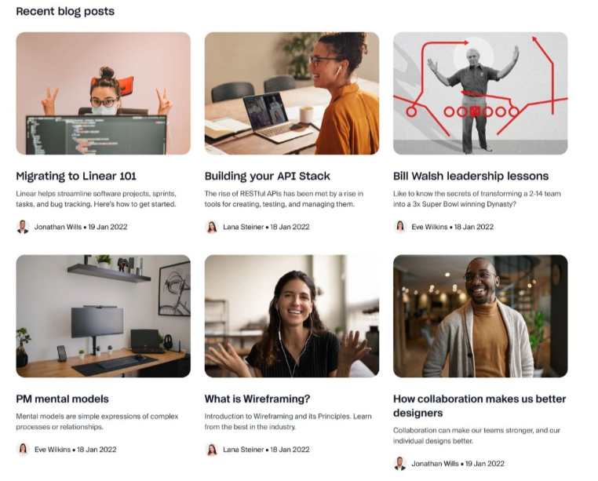

# BlogIt Project Requirements
For your end of Month 2 project, you'll be building BlogIt, a basic yet functional blogging platform that allows users to create accounts, write and manage their blog posts, and maintain a personal profile.

The focus of this project is to practice authentication, CRUD operations, form handling, and user-specific content, all essential skills in full-stack web development.

## Key Features
### User Authentication
- Users can sign up using the following details:
    - first name
    - last name
    - username
    - email address
    - password
- Users can log in using either email or username, with their password
- On successful login, redirect them to a blog listing page
- Implement basic authentication tokens (json web tokens), no need for refresh tokens for now.

### Blogging System
- Users can create blogs with the following details:
  - featured image url
  - title
  - synopsis
  - content (in markdown)
  - date created
  - last updated
  - isDeleted
- On the blog listing page, display each blog post inside a clean, visually appealing card layout. Each card should include:
  - The featured image
  - The blog title
  - A short synopsis
  - The author’s name and avatar (you can use their first name and last name initials)
  - A "Read More" link that navigates to the full blog post

Here is an example:

- In displaying a blog, the markdown content should be displayed as HTML, you can use markdown to HTML tools on npm.
- [Markdown to HTML tools](https://www.npmjs.com/search?q=react%20markdown%20to%20html)
- If a blog has been deleted, don't display it, show a 'not found' message instead.
- Ensure a one-to-many relationship: One user can have many blogs

### User Profile Page
This page should include the following:
- Show all blogs created by the user with options to update or delete.
- If a user clicks on update, redirect them to a page that contains a form with the blog details pre-populated in the form.
- Include a form pre-filled with their personal details (first name, last name, username, email), users can use this form to update their details - implement functionality for users to update their primary information (first name, last name, username, email).
- A separate form to update password.
    - The form should contain input fields for current and new password.
    - If a user wants to update their password, they must enter both the current and the new password, if they enter wrong current password, show them an error and don't update the password.
    - Always hash passwords, even the updated password should be hashed.
- Log out button with implemented functionality for logging out.

## More features
### Header
- [Required feature] Logged out users only see the login and sign up buttons.
- [Required feature] Logged in users can see:
    - posts link (all blogs)
    - new blog link
    - profile link
    - A friendly message in the header e.g _welcome back john_
- [Required feature] a small landing page.
- [Required feature] Protected routes/pages, some pages should only be accessible to logged in users.
- [Optional feature]: allow users to upload profile pictures.

## API Endpoints
- `POST /api/auth/register`: register a user
- `POST /api/auth/login`: login a user
- `POST /api/auth/logout`: logout a user

- `GET /api/blogs`: get all blogs
- `POST /api/blogs`: create a blog.
- `GET /api/blogs/:blogId`: get a specific blog.
- `PATCH /api/blogs/:blogId`: update a blog.
- `DELETE /api/blogs/:blogId`: delete a blog
- `PATCH /api/user`: update user's primary information.
- `PATCH /api/user/password`: update user's password.
- `GET /api/user/blogs`: get all blogs belonging to a specific user.

NOTE: Don't show deleted blogs on a user's profile, only show the blogs that have not been deleted.